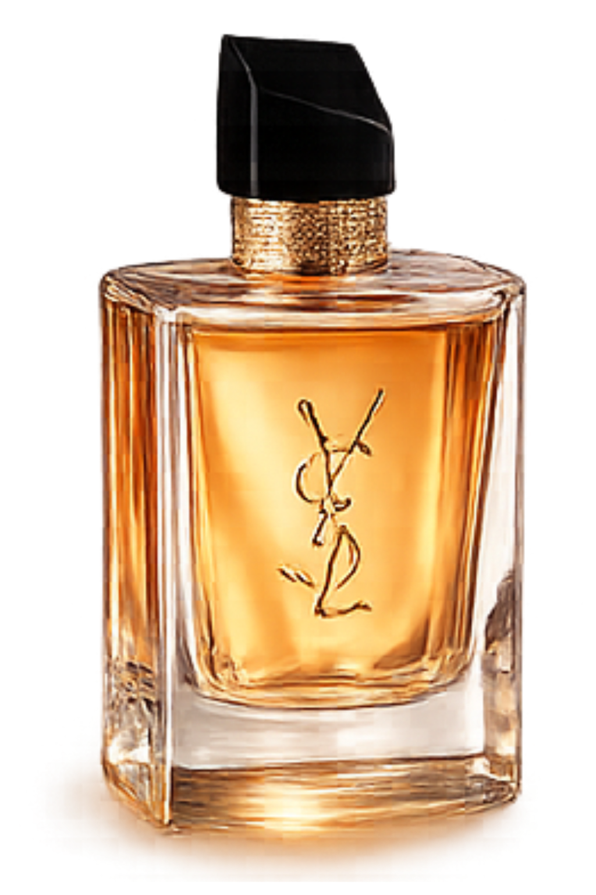

# AURA — Ultra-Premium Luxury Perfume Experience

A state-of-the-art, full-stack luxury e-commerce platform dedicated to high-end fragrances. **AURA** combines sophisticated dark-rose aesthetics with advanced interactive animations to create an unforgettable digital shopping journey.



## ✨ Key Features

- **Ultra-Premium Aesthetics**: A curated "Dark Rose & Champagne Gold" design system that feels exclusive and high-end.
- **Cinematic Interactive Story**: Experience the brand's heritage through a scroll-based storytelling section featuring a high-resolution 360° rotating perfume bottle.
- **Dynamic Hero Section**: Interactive spotlight bottles that gracefully respond to user engagement and link directly to product details.
- **Premium Animations**: Powered by **GSAP** and **ScrollTrigger**, featuring subtle micro-animations, floating rose petals, and shimmering text effects.
- **Full-Stack Functionality**: Complete product grid with filtering, detailed individual product pages, and a dynamic customer review system.
- **Responsive Mastery**: A seamless experience optimized for all devices, from ultra-wide monitors to mobile smartphones.
- **Luxury Sale Banner**: A fixed, shimmering promotional banner with custom micro-interactions to drive engagement.

## 🛠️ Technology Stack

### Frontend
- **React (Vite)**: Modern, lightning-fast UI development.
- **GSAP (GreenSock)**: High-performance animations and cinematic scroll effects.
- **Vanilla CSS**: Bespoke, performance-optimized styling without the weight of heavy frameworks.
- **React Router**: Fluid SPA navigation.

### Backend
- **Node.js & Express**: Scalable and robust server architecture.
- **MongoDB & Mongoose**: Flexible document-based data management for products and reviews.
- **RESTful API**: Clean and documented endpoints for data synchronization.

## 🚀 Getting Started

### Prerequisites
- Node.js (v16+)
- MongoDB (running locally or a cloud instance)

### Installation

1. **Clone the repository**
   ```bash
   git clone <repository-url>
   cd aura-perfume
   ```

2. **Frontend Setup**
   ```bash
   npm install
   npm run dev
   ```

3. **Backend Setup**
   ```bash
   cd server
   npm install
   # Create a .env file with your MONGODB_URI and PORT
   node server.js
   ```

4. **Seed the Database** (Optional)
   ```bash
   # Run the seed script in the server directory
   node scripts/seedData.js
   ```

## 📂 Project Structure

```text
aura-perfume/
├── src/
│   ├── components/       # Bespoke luxury UI components
│   │   ├── FloatingPetals # Ambient background effects
│   │   ├── HeroSection    # Landing experience
│   │   ├── ScrollStory    # GSAP story experience
│   │   ├── StarButton     # Premium interactive CTAs
│   │   └── ...
│   ├── App.jsx           # Main routing and global layout
│   └── index.css         # Global design system & tokens
├── server/
│   ├── models/           # Mongoose schemas
│   ├── routes/           # API endpoints
│   └── scripts/          # Database utilities
└── public/               # High-fidelity visual assets
```

## ⚖️ Design Philosophy

The AURA brand is built on the principle of **Invisible Luxury**. Every interaction is designed to be smooth and deliberate. We use a palette of **Deep Wine Red (#2D0508)**, **Midnight Black (#0A0203)**, and **Champagne Gold (#E8C77A)** to evoke a sense of heritage and exclusivity.

---

*Crafted with Passion. Designed for Elegance.*
